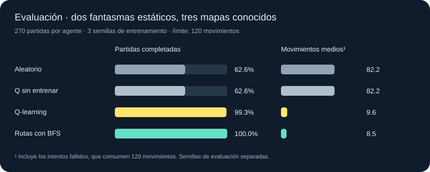
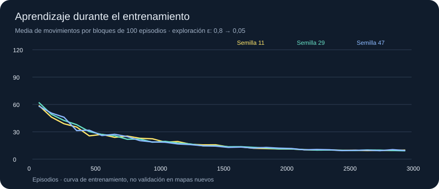

# Pacman · aprendizaje por refuerzo

**Q-learning para aprender a capturar fantasmas en un laberinto.**

Python 3.10+ · biblioteca estándar · tres mapas · modelos guardados · benchmark reproducible

Este repositorio llegó como material inicial de **Aprendizaje Automático de la UC3M**. La asignatura cambió de proyectos y aquel material no se utilizó como entrega. En octubre de 2026 se desarrolló esta extensión personal sobre el motor recibido: agentes, entrenamiento, evaluación y una demo de trayectorias. No se presenta como una práctica realizada durante el grado.

## Qué hace

Pacman debe capturar **dos fantasmas estáticos y visibles** antes de agotar 120 movimientos. El agente aprende por ensayo y error en tres mapas pequeños, con posiciones iniciales aleatorias. No hay comida ni fantasmas que maten a Pacman en este experimento.

La comparación incluye cuatro políticas:

| Agente | Cómo decide |
| --- | --- |
| Q-learning | Aprende valores de acciones en una tabla condicionada por el mapa, la posición y un objetivo. |
| Q sin entrenar | La misma política con una tabla vacía y aprendizaje desactivado; desempata al azar. |
| Aleatorio | Escoge un movimiento legal al azar. |
| Rutas con BFS | Calcula el camino al fantasma más cercano por el laberinto. Referencia informada que no aprende. |

## Resultado medido



| Agente | Partidas completadas | Movimientos medios¹ | Puntuación media |
| --- | ---: | ---: | ---: |
| Aleatorio | 169/270 · 62,6 % | 82,24 | 222,20 |
| Q sin entrenar | 169/270 · 62,6 % | 82,24 | 222,20 |
| **Q-learning** | **268/270 · 99,3 %** | **9,59** | **388,93** |
| Rutas con BFS | 270/270 · 100 % | 8,54 | 391,46 |

¹ Se incluyen las partidas fallidas, que consumen 120 movimientos. La puntuación del motor es `200 × capturas − movimientos`; no es la recompensa que se utiliza para entrenar.

Se entrenan tres modelos independientes con semillas **11, 29 y 47**, durante **3.000 episodios por modelo**. Se evalúan los mismos **90 escenarios** —30 por mapa— en las tres ejecuciones de cada agente: **270 partidas por política**, no 270 tableros distintos. Los modelos aprendidos completan 89/90, 90/90 y 89/90 partidas respectivamente. Los valores de Q quedan congelados y ε = 0 durante la evaluación.

Las semillas de escenario de entrenamiento y evaluación están separadas. Los mapas son los mismos y algunas configuraciones iniciales pueden coincidir: esta prueba mide navegación en mapas conocidos, no generalización a laberintos nuevos. No se ajustaron parámetros a partir del resultado de este benchmark. Las políticas aleatoria y Q sin entrenar obtienen exactamente lo mismo al compartir reglas de desempate y semillas.

Los datos completos están en [benchmark.json](results/reference/benchmark.json), [evaluation.csv](results/reference/evaluation.csv) y [training.csv](results/reference/training.csv). El JSON incluye resultados por mapa, por ejecución y hashes SHA-256 de los tres modelos.



La curva muestra promedios por bloques de 100 episodios de entrenamiento, con exploración decreciente. No representa evaluación fuera de muestra.

## Probarlo

No hace falta instalar paquetes. Desde la raíz del repositorio:

```bash
# Comprobar la extensión y las correcciones del motor
python -m unittest discover -s tests -v

# Verificar los resultados y repetir la evaluación de los tres modelos
python scripts/verify_results.py

# Evaluar el modelo incluido (90 partidas, sin aprendizaje)
python experiment.py evaluate --model results/reference/models/q-seed-11.json

# Entrenar un modelo propio
python experiment.py train --episodes 3000 --seed 11

# Reproducir el benchmark completo sin sobrescribir la referencia
python experiment.py benchmark --episodes 3000 --test-games 30 --output results/local

# Crear los gráficos de esa ejecución
python scripts/report.py results/local
```

Los archivos de `results/reference/` contienen la ejecución documentada. Los experimentos nuevos se guardan por defecto en `results/local/`, que está excluido de Git. Se admiten entre 1 y 5.000 episodios y hasta 1.000 partidas de prueba por mapa.

## Demo visual

Abre [demo/index.html](demo/index.html) en un navegador después de clonar el repositorio. También puedes servir la carpeta localmente:

```bash
python -m http.server 8766 --bind 127.0.0.1
# Abre http://127.0.0.1:8766/demo/
```

La demo permite cambiar de agente y mapa, pausar, reiniciar, ajustar la velocidad y recorrer cada movimiento. Muestra **trayectorias guardadas de partidas reales**, no ejecuta entrenamiento en el navegador. Usa el modelo de la semilla 11 y las mismas posiciones iniciales para comparar las cuatro políticas.

Para regenerar las trayectorias con otro modelo:

```bash
python experiment.py demo --model results/local/models/q-seed-11.json

# Exportar una sola partida, con otro escenario
python experiment.py replay --model results/reference/models/q-seed-11.json --maze detour --seed 1020001 --output results/local/replay.js
```

## Cómo aprende

Cada subproblema consiste en llegar a un fantasma. El agente selecciona el más cercano por distancia Manhattan y mantiene ese objetivo hasta capturarlo. El estado de la tabla es `(mapa, x, y, objetivo_x, objetivo_y)`. No incluye rutas precalculadas ni usa BFS en su política.

La actualización es:

```text
Q(s,a) ← Q(s,a) + α [r + γ max Q(s',a') − Q(s,a)]
α = 0,3; γ = 0,95
r = −1 + 20 si se captura el objetivo + γ Φ(s') − Φ(s)
Φ(s) = −distancia Manhattan al objetivo
```

El máximo sólo considera acciones legales. Al capturar el objetivo, ganar o agotar el tiempo, el término futuro vale cero y la potencial del estado terminal es cero. La siguiente captura empieza un nuevo subproblema; su recompensa no salta artificialmente al cambiar de objetivo. La captura incidental de otro fantasma cuenta en el marcador, pero no añade la bonificación del objetivo seleccionado.

La exploración ε desciende linealmente de 0,8 a 0,05 durante el primer 80 % del entrenamiento. Los desempates son aleatorios y reproducibles. Se excluye `Stop` cuando existen movimientos válidos, igual para las cuatro políticas. La recompensa orienta el aprendizaje, pero no obliga a acercarse en cada paso: el agente puede aprender a alejarse para rodear una pared.

La abstracción resuelve navegación sucesiva, no optimiza globalmente el orden de todas las capturas. El presupuesto restante tampoco forma parte de la tabla. Un mapa desconocido produce estados sin valores aprendidos; este modelo no demuestra aprendizaje transferible a otros mapas.

## Código y validación

| Ruta | Contenido |
| --- | --- |
| `learningAgents.py` | Q-learning, serialización JSON, política aleatoria y referencia BFS. |
| `experiment.py` | Mapas propios, entrenamiento, evaluación, semillas y exportación de partidas. |
| `tests/` | 12 pruebas de actualización, terminales, evaluación congelada, modelos, conectividad y reproducibilidad. |
| `scripts/report.py` | Gráficos SVG generados a partir de los resultados medidos. |
| `scripts/verify_results.py` | Revisión de CSV, hashes de modelos y repetición exacta de sus evaluaciones. |
| `demo/` | Reproductor accesible de trayectorias con HTML, CSS, JavaScript y SVG. |
| `results/reference/` | Tres modelos, resultados completos y gráficos de la ejecución de referencia. |

El motor recibido se ha adaptado para funcionar con Python 3 sin `python-future`. También se han corregido la caché de posiciones de fantasmas, las direcciones compartidas entre estados, la copia de distancias y la prioridad de victoria sobre timeout. Las pruebas verifican que un sucesor no modifica su estado anterior y que una captura actualiza sus posiciones. GitHub Actions ejecuta las pruebas en Python 3.10, 3.12 y 3.13.

## Procedencia y condiciones del material

El motor y los ejercicios iniciales proceden de los [Pacman AI Projects de UC Berkeley](https://ai.berkeley.edu/tracking.html), desarrollados principalmente por John DeNero y Dan Klein, con aportaciones de Brad Miller, Nick Hay y Pieter Abbeel. El material recibido contiene adaptaciones asociadas a la UC3M y su grupo de Planificación y Aprendizaje.

Se conservan los avisos originales de atribución y uso educativo. Sus condiciones incluyen no distribuir ni publicar soluciones: **este repositorio conserva su visibilidad privada**. No se ha añadido una licencia general que cambie esas condiciones. Los ejercicios de inferencia originales siguen como material inicial; la extensión de navegación observable vive en módulos nuevos.

Forma parte del [catálogo de proyectos académicos](https://github.com/cabamarcos/academic-projects), donde se identifica expresamente como desarrollo personal posterior a partir de material de la asignatura.
